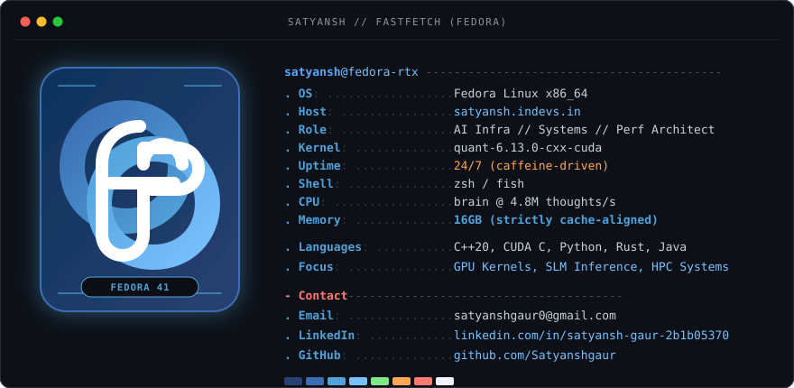

<div align="center">
  
</div>

<br/>

## Periodic LLM Generated Comment (Working inside the Readme):

<!-- satyansh-mini:start -->
```lua
-- ==============================================================================
-- SATYANSH-MINI // NVIM RUNTIME BUFFER (STATUS: ONLINE)
-- ==============================================================================
local vault = require("satyansh.vault")

vault.inference = {
  model              = "SmolLM-135M-Instruct (LoRA)",
  adapter            = "satyansh-lora-r16 (PEFT)",
  fine_tuned_on      = "Satyansh gaur personal data",
  parameters         = "135M + 1.2M LoRA",
  precision          = "FP16",
  runner             = "github-actions-cpu",
  run_id             = 38,
  generated_at       = "2026-09-03 12:44 UTC",
}

-- ==============================================================================
-- LATEST COMPLETION
-- ==============================================================================

local completion = [[
Satyansh thinks that a single clock cycle is enough to render a
256MB image.
]]
```
<!-- satyansh-mini:end -->

---

## A few things the model knows about me, and you'll probably wanna know as well:

### $ whoami

```yaml
name: Satyansh Gaur
located_in: India
role: AI Infrastructure Engineer // Systems Programmer // Performance Architect

numbers_that_matter:
  paytm_hackathon: 1st Place Winner (CommuneOS)
  sgp4_throughput: 275,000 steps/sec (192x Numba JIT)
  graphmem_latency: 12ms multi-hop traversal (Consumer VRAM)
  model_params: 135M + 1.2M LoRA (PEFT)

currently:
  researching: GPU Architecture, Custom CUDA Kernels, Bank Conflict Mitigation
  building: High-Throughput SLM Inference Engines & Multi-Agent Swarms

philosophy: "Hardware reality dictates software architecture."
```

---

### Focus & Stack

- **Active Domains**: High-Performance Computing (HPC), GPU Architecture, CUDA Kernels, Distributed AI Systems
- **Core Languages**: Modern C++ (17/20), CUDA C/C++, Python 3.12, Rust, Java
- **Infrastructure & ML**: PyTorch, TensorRT, vLLM, Triton, Numba JIT, ChromaDB, FAISS, Docker

<br/>

<div align="center">

[](https://satyansh.indevs.in)
[](https://github.com/Satyanshgaur)
[](https://www.linkedin.com/in/satyansh-gaur-2b1b05370)
[](https://www.kaggle.com/satyanshgaur1)
[](https://x.com/GaurSatyansh)
[](mailto:satyanshgaur0@gmail.com)

</div>
